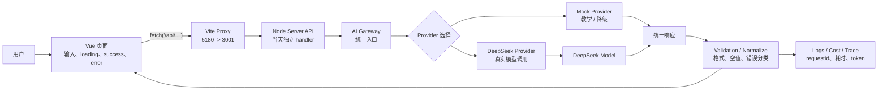

# W01 Day 01：真实场景与边界

本周主题：AI Gateway：前端如何安全接入真实模型

建议时间：2～3 小时

## 今天的目标

先判断这个能力在真实产品里解决什么问题，以及前端、服务端、模型分别负责什么。

## 开课前先把四个词串起来

你已经认识真实模型、RAG、Agent、MCP 这些名词，现在要解决的是“什么时候用谁，以及它们怎么串”。

先用这个判断表：

| 能力 | 解决什么问题 | 什么时候用 | 什么时候不要用 |
| --- | --- | --- | --- |
| 真实模型 | 生成、改写、总结、判断开放文本 | 任务需要语言理解或生成 | 需要确定事实但没有资料时 |
| RAG | 先找资料，再基于资料回答 | 模型需要你的私有文档、接口契约、代码知识 | 只是改写语气、总结用户输入时 |
| Tool / MCP | 让 AI 调用受控外部能力 | 需要查系统、读文件、调接口、执行动作 | 模型自己回答就够时 |
| Agent | 根据中间结果动态决定下一步 | 流程不固定，需要多步查证 | 固定流程能完成时 |
| Multi-Agent | 多个角色长期协作 | 大任务确实有不同职责和独立状态 | 一个 Agent 或 workflow 能完成时 |
| Skill | 固化长期复用的做事规则 | 规则稳定、可复用、希望每次都遵守 | 临时任务或一次性业务参数 |

最重要的口诀：

```text
能写死流程，就不要 Agent；
能一个 Agent 完成，就不要 Multi-Agent；
需要执行动作，才做 Tool / MCP；
需要查资料，才做 RAG；
需要长期复用的做事规范，才放 Skill。
```

以前端接口契约助手为例：

- RAG：查接口文档、代码片段、历史需求；
- Tool / MCP：提供 lookupApiField、searchCodeReference、readFile 这类受控工具；
- Skill：字段不能猜、不允许多字段兜底、一个前端字段只对应一个明确后端字段；
- Workflow / Agent：理解问题 -> 查契约 -> 查代码 -> 判断是否明确 -> 不明确追问 -> 明确给方案；
- Multi-Agent：只有任务大到需要不同角色长期协作时才拆，例如接口契约 Agent、代码引用 Agent、测试风险 Agent。

所以第一周先做 AI Gateway。它是后面所有能力的入口：没有稳定的模型调用边界，RAG、Agent、MCP 都只是能演示但不可靠的玩具。

## 今天不学什么

- 不学概念名词堆砌；
- 不重复基础前端知识；
- 不为了炫技引入暂时用不上的框架；
- 不做和求职项目无关的玩具功能。

## 真实任务背景

前端不能直接把 API Key 暴露给浏览器，也不能把模型错误、超时、供应商差异全部丢给页面处理。本周你要做的是 AI 应用的服务端入口。

本周构建目标：

> 在 demo-app 里做一个 Node AI Gateway：前端只请求自己的服务端，服务端支持 mock / DeepSeek Provider，统一返回格式、错误类型和 requestId。

## 前端怎么入手

用你熟悉的 Vue 页面发起请求、展示 loading / success / error，并观察 Network 里前端到底看不到哪些敏感信息。

## 今天要完成

- [x] 用一句话写清楚真实问题。
- [x] 画出前端、服务端、模型 / 数据、验证层之间的边界。
- [x] 写清楚前端切入点。
- [x] 列出本周必须补的后端基础。
- [x] 列出本周不做什么，避免范围失控。

## 今日任务完成记录

### 1. 用一句话写清楚真实问题

你的回答：

> 前端不能直接把 API Key 暴露给浏览器，也不能把模型错误、超时、供应商差异全部丢给页面处理。本周你要做的是 AI 应用的服务端入口。（为了安全，成本可控）

老师补充版：

> AI 功能不能像普通前端接口一样直接从浏览器请求模型供应商；必须通过自己的服务端 Gateway 统一处理 API Key、Provider 切换、超时、错误分类、日志、成本和降级策略。

这一点不是为了“多加一层后端”，而是为了：

- 安全：API Key 不暴露给浏览器；
- 成本可控：服务端可以记录 token、调用次数、provider、model；
- 错误可控：不同模型供应商的错误可以统一成前端可理解的错误类型；
- 体验可控：前端只关心 loading / success / error，不直接处理供应商细节；
- 后续可扩展：RAG、Tool、Agent、MCP 都可以接在 Gateway 后面。

### 2. AI Gateway 边界图



这张图里你要重点看边界：

| 层 | 负责什么 | 不负责什么 |
| --- | --- | --- |
| Vue 页面 | 用户输入、按钮状态、loading、success、error、展示结果 | 不保存 API Key，不直接调用 DeepSeek |
| Vite Proxy | 开发环境把 `/api` 转发到 3001 | 不做业务逻辑 |
| Node Server API | 接收前端请求、读取 body、选择当天 handler | 不直接写页面 UI |
| AI Gateway | Provider 抽象、超时、错误分类、统一响应、日志入口 | 不关心具体页面布局 |
| Provider | 对接 mock / DeepSeek 等模型供应商 | 不决定前端怎么展示 |
| Validation / Normalize | 判断空响应、格式错误、错误类型、统一返回结构 | 不凭空补业务字段 |
| Logs / Cost / Trace | 记录 requestId、耗时、token、provider、错误 | 不影响用户输入本身 |

### 3. 前端切入点

你提到的问题：

> 你给我这个例子我不管怎么输入输出都是一样的呀。

这个判断是对的。

Day01 当前页面不是“真实模型调用 demo”，而是“架构链路导览”。所以输入变化不影响核心输出，它的目的不是让你看 AI 生成结果，而是让你看懂：

```text
day-01.vue
→ fetch('/api/advanced/week-01/day-01')
→ Vite proxy
→ Node server
→ server/advanced-labs/week-01/day-01.js
→ 返回 trace / output
→ day-01.vue 展示
```

Day01 的学习重点是：

- 前端页面怎么进入自己的服务端；
- 5180 和 3001 分别是什么；
- 为什么浏览器 Network 里不应该看到 DeepSeek API Key；
- 为什么模型调用要放在服务端；
- 为什么 Day01 先讲边界，Day02 才开始最小代码闭环。

所以 Day01 不要求你观察“不同输入生成不同结果”。这个要放到 Day02 / Day03 做。

### 4. 本周必须补的后端基础

本周只补 AI Gateway 需要的后端知识，不扩散成完整后端课程。

| 后端基础 | 你需要学到什么程度 | 为什么本周需要 |
| --- | --- | --- |
| Node HTTP 路由 | 知道请求如何从 `/api/...` 进入对应 handler | 前端不能直接调模型，必须先进入自己的服务端 |
| 环境变量读取 | 知道 `.env` 里的 API Key 只能服务端读取 | 避免 API Key 暴露到浏览器 |
| Provider service 分层 | 知道 mock / DeepSeek 应该有统一调用接口 | 后面要支持切换模型和降级 |
| 请求超时 | 知道模型慢时服务端要主动中断或返回错误 | AI 响应时间不稳定，不能让页面一直等 |
| 错误分类 | 知道要把无 Key、超时、供应商错误分开 | 前端才能展示合理的用户提示，开发者才能排查 |

本周不要求你学习：

- 数据库设计；
- 登录鉴权；
- 复杂框架；
- 微服务；
- 部署；
- 完整后端工程架构。

这些后面会按需要补。

### 5. 本周不做什么

为了避免范围失控，本周明确不做：

- 不做完整聊天产品；
- 不做 RAG；
- 不做 Agent；
- 不做 MCP；
- 不做多轮上下文记忆；
- 不做数据库持久化；
- 不做用户系统；
- 不做复杂 UI；
- 不追求模型回答质量；
- 不把所有错误一次性处理完。

本周只做一件事：

```text
让前端通过自己的服务端安全进入模型能力，并理解这条链路的工程边界。
```

## 今天要补的后端知识

- Node HTTP 路由
- 环境变量读取
- Provider service 分层
- 请求超时
- 错误分类

> 只补到能完成今天任务，不要求一次学成后端工程师。

## 工程约束

- 每次只扩展一个明确能力；
- 前端不直接持有模型 API Key；
- 服务端要处理失败、空响应、格式错误、超时和非法参数；
- 不确定的接口字段、数据类型、业务含义不能猜；
- 涉及 RAG、Tool、Agent、MCP 的能力必须留下 Trace 或可验证证据；
- 结论优先沉淀通用规律，不把单个 Demo 案例当成全部知识。

## 产出物

- 一张 AI Gateway 边界图
- 一次真实 DeepSeek 调用日志
- 三类失败日志：无 Key、超时、Provider 错误

## 今日复盘问题

1. 今天这项能力解决了真实 AI 项目里的什么问题？
2. 前端负责什么？服务端负责什么？模型或数据层负责什么？
3. 今天补的后端知识为什么是必要的？
4. 如果模型、检索或工具调用失败，用户会看到什么，开发者能看到什么？
5. 这项能力能怎样写进你的求职项目？

## 写入位置

把今天结论和你问我的问题写入：

`advanced-track/lessons/week-01/day-01.md`

周总结写入：

`advanced-track/reviews/week-01.md`

## 学习问答记录

### Q1：我学完今天后，最低通过标准是什么？

直接结论：不是“看懂概念”，而是能跑出或画出一条可验证链路，并能解释失败时怎么处理。

工程解释：AI 应用和普通 CRUD 最大的差异在于不确定性。模型可能慢、错、空、格式乱、成本高，所以每一天都必须留下运行证据或失败证据。

对应知识点：端到端闭环、服务端边界、失败兜底、日志 / Trace、面试证据。

### Q2：为什么 Day01 页面不管怎么输入，输出看起来都差不多？

直接结论：因为 Day01 是架构边界导览课，不是真实模型生成课。输入不影响核心结论是正常的，但页面应该明确告诉你它在教“链路和边界”，而不是伪装成模型效果 demo。

工程解释：Day01 的价值是让你看清请求路径：

```text
Vue 页面
→ /api/advanced/week-01/day-01
→ Vite proxy
→ Node Server
→ day-01.js handler
→ trace / output
→ Vue 页面展示
```

这节课要验证的是前端和服务端边界，而不是模型根据不同输入生成不同内容。真正观察模型输出差异，应放到 Day02 / Day03 接入 `/api/ai/chat` 和 Provider 后再做。

对应知识点：课程目标要和 demo 行为一致。架构课看链路，模型课看生成，评测课看样本和指标，不能混在一起。
