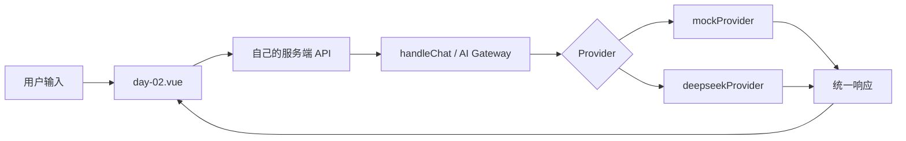

# W01 Day 02：最小代码闭环

本周主题：AI Gateway：前端如何安全接入真实模型  
建议时间：2 到 3 小时

## 今天的目标

今天不再只讨论“为什么需要 AI Gateway”，而是要跑通一条最小可验证链路：

```text
Vue 页面输入
-> 调用自己的服务端 API
-> 服务端进入 AI Gateway
-> Gateway 选择 mock 或 DeepSeek Provider
-> 返回统一响应
-> 页面展示结果、错误和 requestId
```

你今天学到的不是“模型能生成文字”，而是：

- 前端如何只调用自己的服务端，而不是直接调用模型供应商；
- 服务端如何把模型能力包成一个稳定接口；
- 一次 AI 请求至少要留下哪些工程证据；
- 为什么 Day 01 看边界，Day 02 才开始看代码闭环。

## 和 Day 01 的区别

Day 01 的重点是边界：前端、服务端、模型、验证层分别负责什么。

Day 02 的重点是闭环：让一次请求真的从页面走到服务端，再从服务端返回页面。

判断标准也不一样：

| 日期 | 重点 | 你要证明什么 | 不要求什么 |
| --- | --- | --- | --- |
| Day 01 | 架构边界 | 能说清为什么不能前端直连模型 | 不要求真实调用模型 |
| Day 02 | 最小闭环 | 能跑通一次请求，并拿到 requestId / Trace / Network 证据 | 不要求做成完整聊天产品 |

如果 Day 02 还只是返回固定文案，那它就没有完成“最小代码闭环”的课程价值。

## 今天不学什么

- 不做完整聊天窗口；
- 不做多轮上下文；
- 不做 RAG；
- 不做 Agent；
- 不做 MCP；
- 不做数据库持久化；
- 不追求模型回答质量；
- 不一次性处理所有异常。

今天只做一件事：让前端安全地通过自己的服务端进入模型能力。

## 真实任务背景

很多前端同学第一次接 AI API 时，容易直接在浏览器里请求模型接口。这样有几个问题：

- API Key 会暴露在浏览器；
- 模型供应商的错误格式会直接污染前端逻辑；
- 超时、空响应、限流、余额不足等问题没有统一处理入口；
- 后续想切换 provider、记录 token 成本、做降级会很难。

所以真实项目里通常会多一层服务端 Gateway。

本周最终目标：

> 在 `demo-app` 里做一个 Node AI Gateway：前端只请求自己的服务端，服务端支持 mock / DeepSeek Provider，统一返回格式、错误类型和 requestId。

今天只完成最小闭环，不追求完整。

## 你今天要读哪些文件

按这个顺序读，不要一上来全项目乱翻：

1. `demo-app/src/advanced-labs/days/week-01/day-02.vue`

   看页面如何收集输入、触发请求、展示 loading / success / error。

2. `demo-app/server/index.js`

   看 `/api/...` 请求如何进入 Node 服务端，以及 day handler 是怎么被挂进去的。

3. `demo-app/server/advanced-labs/week-01/day-02.js`

   看当天课程接口现在返回了什么。当前它更像课程 trace，不是真正的 `/api/ai/chat` 闭环。

4. `demo-app/server/ai-gateway/handleChat.js`

   看真正的 AI Gateway 入口应该怎么接收输入、选择 provider、返回统一格式。

5. `demo-app/server/providers/mockProvider.js`

   看不依赖真实模型时，如何用 mock provider 跑通链路。

6. `demo-app/server/providers/deepseekProvider.js`

   看真实模型 provider 如何读取环境变量、发请求、处理 provider 错误。

今天不是要求你背代码，而是能画出“请求从哪里进、从哪里出、失败在哪里被处理”。

## 前端怎么入手

从页面角度，你只关心四件事：

- 用户输入是什么；
- 请求发到哪个自己的服务端地址；
- 请求中有没有带 API Key；
- 返回后页面如何展示成功、失败和 requestId。

前端今天不应该关心：

- DeepSeek 的真实接口地址；
- DeepSeek 的 API Key；
- provider 原始错误结构；
- token 计算细节；
- 服务端内部如何选择 mock 还是真实模型。

前端视角的最小代码闭环：

```text
输入框
-> 点击运行
-> fetch('/api/ai/chat' 或当天封装接口)
-> loading
-> 展示 result
-> 展示 requestId
-> error 时展示用户能看懂的提示
```

## 服务端怎么入手

服务端今天只补够这几个点：

| 后端点 | 今天学到什么程度 | 为什么需要 |
| --- | --- | --- |
| Node HTTP 路由 | 知道请求如何从 `/api/...` 进入 handler | 前端必须先进入自己的服务端 |
| JSON body | 知道如何读取用户输入 | 模型任务需要服务端拿到 prompt |
| Provider 抽象 | 知道 mock / DeepSeek 可以共用同一个调用形状 | 后续能切换模型或降级 |
| requestId | 知道每次请求都要有唯一标识 | 出问题时能定位日志 |
| 统一响应 | 知道成功和失败都要返回稳定结构 | 前端不被供应商差异拖垮 |
| 错误分类 | 先区分缺少 Key、超时、provider 错误 | 方便页面提示和开发排查 |

不要把今天扩展成完整后端课。够用就停。

## 最小响应结构

今天你要理解一件事：前端不能直接依赖模型供应商的原始响应。

更合理的服务端返回应该长这样：

```json
{
  "requestId": "req_xxx",
  "ok": true,
  "provider": "mock",
  "output": "模型或 mock 返回的文本",
  "usage": {
    "inputTokens": 12,
    "outputTokens": 30
  },
  "error": null
}
```

失败时也要稳定：

```json
{
  "requestId": "req_xxx",
  "ok": false,
  "provider": "deepseek",
  "output": "",
  "usage": null,
  "error": {
    "type": "PROVIDER_ERROR",
    "message": "模型服务暂时不可用，请稍后重试"
  }
}
```

这里的重点不是字段名一定要和上面完全一致，而是工程原则：

- 成功和失败都有 `requestId`；
- 前端不直接吃 provider 原始错误；
- error type 要能分类；
- output 为空时也要有明确状态；
- 不要用多个不确定字段互相兜底。

## 今天要完成

- [ ] 读懂 Day 02 页面请求发到哪里；(通过demo-app\server\index.js 已经拦截 去发送了真实的大模型请求， 没有走demo-app\server\advanced-labs\week-01\day-02.js)
- [ ] 找到服务端路由如何进入 Day 02 handler；
- [ ] 找到真正 AI Gateway 的 `handleChat` 入口；
- [ ] 用 mock provider 跑通一次请求；
- [ ] 在页面、Network 或服务端日志中记录一次 `requestId`；
- [ ] 说明这次请求没有把 API Key 暴露到浏览器；
- [ ] 至少观察一个失败场景：空输入、缺少 Key、provider 错误或超时。

## 动手练习 1：画出今天的请求链路

先不要写代码，先画链路：



验收问题：

1. 浏览器 Network 里应该看到请求哪个地址？
2. 浏览器 Network 里不应该看到什么？
3. 如果 provider 失败，错误应该在哪里被分类？
4. requestId 应该由前端生成还是服务端生成？

## 动手练习 2：跑通一次 mock 请求

先用 mock provider，不要一开始就依赖真实模型。

你要观察：

- 页面是否能输入文本；
- 点击后是否出现 loading；
- Network 是否能看到自己的服务端请求；
- 响应里是否有 `requestId`；
- 页面是否展示服务端返回内容；
- 服务端日志是否能对应到同一个 `requestId`。

记录模板：

```md
### Day 02 成功链路记录

- 输入：
- 请求地址：
- provider：
- requestId：
- 页面结果：
- Network 观察：
- 服务端日志：
- API Key 是否出现在浏览器：否
```

## 动手练习 3：观察一个失败场景

今天至少做一个失败案例。推荐从最简单的开始：

| 失败场景 | 怎么触发 | 你要观察什么 |
| --- | --- | --- |
| 空输入 | 不输入内容直接提交 | 服务端是否拒绝或返回明确错误 |
| 缺少 API Key | 使用真实 provider 但不配置 Key | 是否返回 `MISSING_API_KEY` 一类错误 |
| provider 错误 | 模拟 provider 抛错 | 前端是否只看到统一错误提示 |
| 超时 | 模拟慢响应 | 服务端是否能中断或返回超时错误 |

记录模板：

```md
### Day 02 失败链路记录

- 失败类型：
- 触发方式：
- requestId：
- 前端看到：
- 服务端看到：
- 这类错误为什么不能直接交给页面处理：
```

## 今天的验收标准

今天通过，不是因为你“看懂了 AI Gateway 这个词”，而是你能回答：

1. Day 02 和 Day 01 的学习目标有什么区别？
2. 前端请求为什么只能打到自己的服务端？
3. 一次 AI 请求为什么必须有 `requestId`？
4. mock provider 的价值是什么？
5. 真实 provider 为什么不能直接被页面调用？
6. 如果模型返回空内容，前端应该怎么知道这是失败还是正常空结果？
7. 如果线上用户反馈“AI 没反应”，你用什么证据排查？

最低通过标准：

- 能跑通或清楚描述一条前端到服务端的请求链路；
- 能指出 API Key 没有出现在浏览器；
- 能拿到一次 `requestId` 或 Trace；
- 能说清一个失败场景的前端表现和服务端表现；
- 能把今天的记录写进 `advanced-track/reviews/week-01.md`。

## 今天要补的后端知识

- Node HTTP 路由；
- JSON body 读取；
- 环境变量读取；
- Provider service 分层；
- 请求超时；
- 错误分类；
- 日志和 requestId。

只补到能完成今天任务，不要求一次学成后端工程师。

## 工程约束

- 每次只扩展一个明确能力；
- 前端不直接持有模型 API Key；
- 服务端要处理失败、空响应、格式错误、超时和非法参数；
- 不清楚的接口字段、数据类型、业务含义不能猜；
- 不使用多个未知字段互相兜底；
- 涉及 RAG、Tool、Agent、MCP 的能力必须留下 Trace 或可验证证据；
- 结论优先沉淀通用规律，不把单个 Demo 案例当成全部知识。

## 产出物

今天至少留下这三类证据中的两类：

- 一条成功请求记录：输入、请求地址、provider、requestId、输出；
- 一条失败请求记录：失败类型、前端提示、服务端日志、requestId；
- 一张最小闭环图：Vue 页面到 AI Gateway 再回到页面。

## 今日复盘问题

1. 今天你实际跑通的是哪条链路？
2. 请求从页面进入服务端时，经过了哪些文件？
3. mock provider 和 DeepSeek provider 的职责有什么不同？
4. 前端为什么不应该处理 provider 原始错误？
5. requestId 在排查问题时怎么用？
6. 如果今天只完成 mock，没有接真实模型，算不算通过？为什么？
7. 这条最小闭环后面如何扩展成 RAG、Tool 或 Agent？

## 写入位置

把今天的成功链路、失败链路和你的问题写入：

`advanced-track/reviews/week-01.md`

如果今天产生新的课程问题，也可以继续追加到本文件的“学习问答记录”。

## 学习问答记录

### Q1：为什么我感觉 Day 01 和 Day 02 很像？

直接结论：你的感觉是对的。当前 `demo-app/server/advanced-labs/week-01/day-01.js` 和 `day-02.js` 的核心执行逻辑几乎一样，主要差异只是课程元信息、标题、flowSteps 和 handler 名称。

工程解释：Day 01 应该是“架构边界导览”，Day 02 应该是“最小代码闭环”。如果两个文件都只是返回同一类 trace，那么学习体验就会变成重复。Day 02 需要明确进入 `/api/ai/chat` 或 AI Gateway 的实际调用链路，才配得上“最小代码闭环”。

对应知识点：课程目标要和 demo 行为一致。架构课看边界，闭环课看请求链路，模型课看生成质量，评测课看样本和指标。

### Q2：今天如果还没有真实 DeepSeek Key，能不能学？

直接结论：能。今天优先用 mock provider 跑通闭环，真实模型不是第一优先级。

工程解释：mock provider 的价值是把“前端 -> 服务端 -> Gateway -> Provider -> 统一响应 -> 前端展示”这条链路先稳定下来。只要链路稳定，后面把 mock 换成 DeepSeek 才是可控的。如果一开始就依赖真实模型，失败时你分不清是路由错、body 错、Key 错、provider 错，还是模型响应慢。

对应知识点：先闭环，再真实；先 mock，再 provider；先证据，再优化。

### Q3：今天最应该留下什么证据？

直接结论：一次成功链路记录，加一次失败链路记录。

工程解释：AI 工程不是“我感觉能用”，而是要能定位、复现和解释。成功记录证明链路通了，失败记录证明你知道边界在哪里、错误在哪里被处理、用户和开发者分别看到什么。

对应知识点：requestId、Network、服务端日志、统一响应、错误分类。
