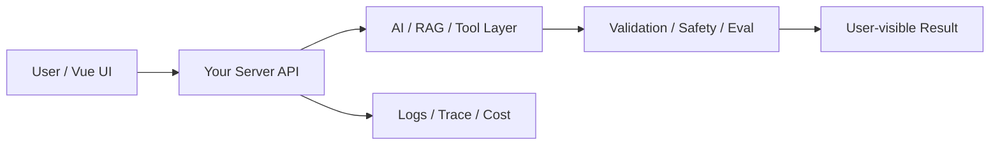

# W01 复盘：AI Gateway：前端如何安全接入真实模型

## 本周投入时间

-

## 本周完成的工程证据

- [ ] 一张 AI Gateway 边界图
- [ ] 一次真实 DeepSeek 调用日志
- [ ] 三类失败日志：无 Key、超时、Provider 错误

## 本周补齐的后端基础

- [ ] Node HTTP 路由
- [ ] 环境变量读取
- [ ] Provider service 分层
- [ ] 请求超时
- [ ] 错误分类

## 核心架构图

## 成功链路

- 输入：
- 服务端处理：
- AI / 数据层处理：
- 输出：
- 证据：

## 失败案例

- 现象：
- 原因：
- 修复或兜底：
- 下次如何提前发现：

## 可面试表达

### 30 秒版本

### 3 分钟版本

### 可能被追问

1.
2.
3.

## 下周继承

-
