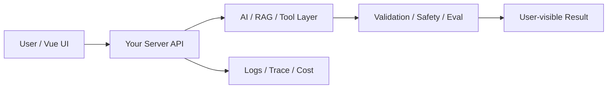

# W02 复盘：Streaming：AI 响应慢时前端体验怎么做

## 本周投入时间

-

## 本周完成的工程证据

- [ ] 流式输出录屏或截图
- [ ] 取消生成的 Network / 日志证据
- [ ] 状态机图：idle -> streaming -> done / cancelled / failed

## 本周补齐的后端基础

- [ ] SSE 响应头
- [ ] ReadableStream 基础
- [ ] AbortController
- [ ] 连接断开处理
- [ ] 首字延迟记录

## 核心架构图

## 成功链路

- 输入：
- 服务端处理：
- AI / 数据层处理：
- 输出：
- 证据：

## 失败案例

- 现象：
- 原因：
- 修复或兜底：
- 下次如何提前发现：

## 可面试表达

### 30 秒版本

### 3 分钟版本

### 可能被追问

1.
2.
3.

## 下周继承

-
