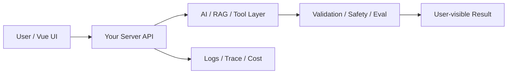

# W03 复盘：结构化输出：让模型结果能进入业务系统

## 本周投入时间

-

## 本周完成的工程证据

- [ ] Schema 文件或类型定义
- [ ] 10 条格式失败样本
- [ ] 修复前后对照日志

## 本周补齐的后端基础

- [ ] 运行时 Schema 校验
- [ ] JSON parse 防御
- [ ] 错误码设计
- [ ] 一次重试策略
- [ ] 服务端字段契约

## 核心架构图

## 成功链路

- 输入：
- 服务端处理：
- AI / 数据层处理：
- 输出：
- 证据：

## 失败案例

- 现象：
- 原因：
- 修复或兜底：
- 下次如何提前发现：

## 可面试表达

### 30 秒版本

### 3 分钟版本

### 可能被追问

1.
2.
3.

## 下周继承

-
