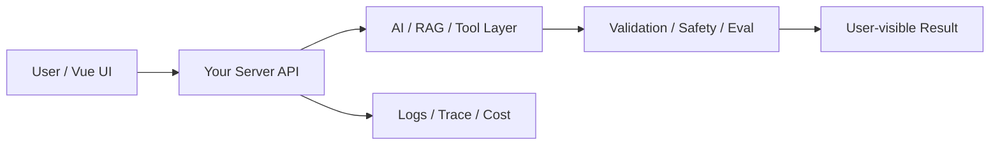

# W04 复盘：Prompt Registry 与评测：不要把 Prompt 写成散落字符串

## 本周投入时间

-

## 本周完成的工程证据

- [ ] Prompt Registry 代码
- [ ] 30 条评测样本
- [ ] v1 / v2 回归对比表

## 本周补齐的后端基础

- [ ] 配置与代码分离
- [ ] 任务路由
- [ ] 版本号设计
- [ ] 评测脚本
- [ ] 回归报告

## 核心架构图

## 成功链路

- 输入：
- 服务端处理：
- AI / 数据层处理：
- 输出：
- 证据：

## 失败案例

- 现象：
- 原因：
- 修复或兜底：
- 下次如何提前发现：

## 可面试表达

### 30 秒版本

### 3 分钟版本

### 可能被追问

1.
2.
3.

## 下周继承

-
