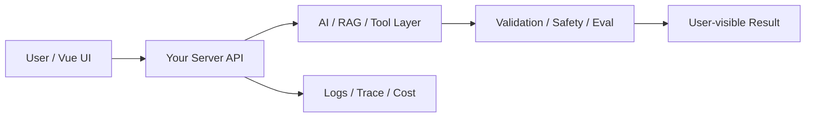

# W05 复盘：会话、日志、成本：AI 功能上线前必须补的后端基础

## 本周投入时间

-

## 本周完成的工程证据

- [ ] 调用日志样例
- [ ] 一次失败 requestId 追踪记录
- [ ] 成本 / 延迟统计截图或表格

## 本周补齐的后端基础

- [ ] 日志模型设计
- [ ] 简单持久化 JSON / SQLite 思路
- [ ] token 与成本字段
- [ ] 敏感信息脱敏
- [ ] 请求追踪

## 核心架构图

## 成功链路

- 输入：
- 服务端处理：
- AI / 数据层处理：
- 输出：
- 证据：

## 失败案例

- 现象：
- 原因：
- 修复或兜底：
- 下次如何提前发现：

## 可面试表达

### 30 秒版本

### 3 分钟版本

### 可能被追问

1.
2.
3.

## 下周继承

-
