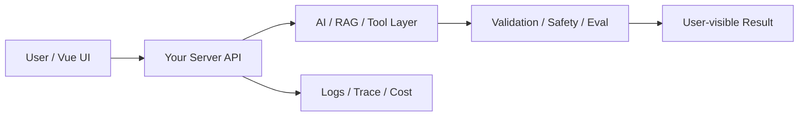

# W06 复盘：项目一：AI 职场沟通助手工程化版本

## 本周投入时间

-

## 本周完成的工程证据

- [ ] 可演示项目
- [ ] 30 条评测结果
- [ ] 项目 README 与架构图

## 本周补齐的后端基础

- [ ] 端到端接口设计
- [ ] DTO / ViewModel 边界
- [ ] 错误码到 UI 状态映射
- [ ] 最小验收接口
- [ ] 本地部署

## 核心架构图

## 成功链路

- 输入：
- 服务端处理：
- AI / 数据层处理：
- 输出：
- 证据：

## 失败案例

- 现象：
- 原因：
- 修复或兜底：
- 下次如何提前发现：

## 可面试表达

### 30 秒版本

### 3 分钟版本

### 可能被追问

1.
2.
3.

## 下周继承

-
