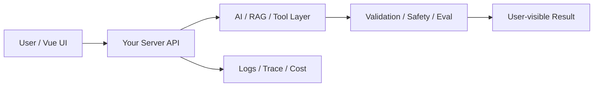

# W07 复盘：RAG 数据准备：文档解析、Chunk 与 Metadata

## 本周投入时间

-

## 本周完成的工程证据

- [ ] 导入脚本
- [ ] chunk 样例
- [ ] metadata 字段说明

## 本周补齐的后端基础

- [ ] 文件读取
- [ ] 数据清洗
- [ ] chunk 策略
- [ ] metadata 设计
- [ ] 导入脚本

## 核心架构图

## 成功链路

- 输入：
- 服务端处理：
- AI / 数据层处理：
- 输出：
- 证据：

## 失败案例

- 现象：
- 原因：
- 修复或兜底：
- 下次如何提前发现：

## 可面试表达

### 30 秒版本

### 3 分钟版本

### 可能被追问

1.
2.
3.

## 下周继承

-
