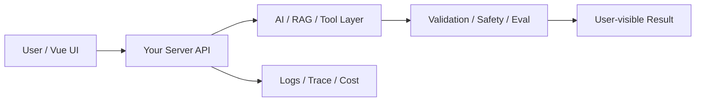

# W08 复盘：检索实现：关键词、向量与混合召回

## 本周投入时间

-

## 本周完成的工程证据

- [ ] 三种检索结果对比
- [ ] 10 条失败查询归因
- [ ] 检索调试页面截图

## 本周补齐的后端基础

- [ ] embedding 调用
- [ ] 向量相似度
- [ ] topK
- [ ] 关键词索引
- [ ] 召回结果合并

## 核心架构图

## 成功链路

- 输入：
- 服务端处理：
- AI / 数据层处理：
- 输出：
- 证据：

## 失败案例

- 现象：
- 原因：
- 修复或兜底：
- 下次如何提前发现：

## 可面试表达

### 30 秒版本

### 3 分钟版本

### 可能被追问

1.
2.
3.

## 下周继承

-
