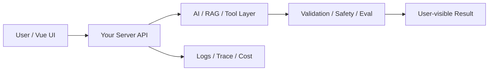

# W09 复盘：可信回答：引用、拒答与冲突证据

## 本周投入时间

-

## 本周完成的工程证据

- [ ] 有引用回答案例
- [ ] 拒答案例
- [ ] 冲突证据案例

## 本周补齐的后端基础

- [ ] 上下文拼装
- [ ] 引用结构
- [ ] 拒答规则
- [ ] 冲突检测
- [ ] 答案后校验

## 核心架构图

## 成功链路

- 输入：
- 服务端处理：
- AI / 数据层处理：
- 输出：
- 证据：

## 失败案例

- 现象：
- 原因：
- 修复或兜底：
- 下次如何提前发现：

## 可面试表达

### 30 秒版本

### 3 分钟版本

### 可能被追问

1.
2.
3.

## 下周继承

-
