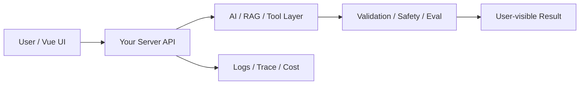

# W10 复盘：RAG 评测：把“效果还行”变成指标

## 本周投入时间

-

## 本周完成的工程证据

- [ ] 50 条 RAG 评测集
- [ ] 失败分类表
- [ ] 优化前后指标

## 本周补齐的后端基础

- [ ] 评测数据格式
- [ ] 批量运行脚本
- [ ] 指标计算
- [ ] 失败归因
- [ ] 回归对比

## 核心架构图

## 成功链路

- 输入：
- 服务端处理：
- AI / 数据层处理：
- 输出：
- 证据：

## 失败案例

- 现象：
- 原因：
- 修复或兜底：
- 下次如何提前发现：

## 可面试表达

### 30 秒版本

### 3 分钟版本

### 可能被追问

1.
2.
3.

## 下周继承

-
