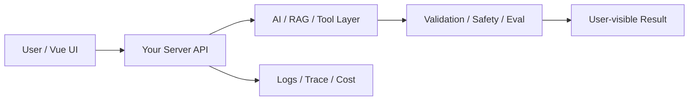

# W11 复盘：项目二：前端接口契约 RAG 助手

## 本周投入时间

-

## 本周完成的工程证据

- [ ] 可演示 RAG 项目
- [ ] 50 条评测报告
- [ ] 字段引用截图与架构图

## 本周补齐的后端基础

- [ ] RAG API 分层
- [ ] 知识库更新流程
- [ ] 缓存策略
- [ ] 权限边界
- [ ] 项目 README

## 核心架构图

## 成功链路

- 输入：
- 服务端处理：
- AI / 数据层处理：
- 输出：
- 证据：

## 失败案例

- 现象：
- 原因：
- 修复或兜底：
- 下次如何提前发现：

## 可面试表达

### 30 秒版本

### 3 分钟版本

### 可能被追问

1.
2.
3.

## 下周继承

-
