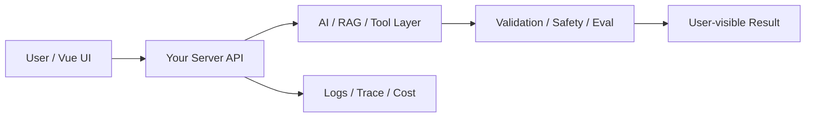

# W12 复盘：Tool Calling：模型建议，程序裁决

## 本周投入时间

-

## 本周完成的工程证据

- [ ] 两个工具定义
- [ ] 异常参数拒绝记录
- [ ] 工具调用 Trace 截图

## 本周补齐的后端基础

- [ ] Tool Schema
- [ ] 参数校验
- [ ] 只读工具
- [ ] 工具结果归一化
- [ ] Trace 记录

## 核心架构图

## 成功链路

- 输入：
- 服务端处理：
- AI / 数据层处理：
- 输出：
- 证据：

## 失败案例

- 现象：
- 原因：
- 修复或兜底：
- 下次如何提前发现：

## 可面试表达

### 30 秒版本

### 3 分钟版本

### 可能被追问

1.
2.
3.

## 下周继承

-
