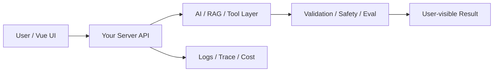

# W13 复盘：写操作边界：确认、幂等与审计

## 本周投入时间

-

## 本周完成的工程证据

- [ ] 写操作确认流程截图
- [ ] 重复提交防护日志
- [ ] 审计日志样例

## 本周补齐的后端基础

- [ ] 写操作权限
- [ ] 幂等键
- [ ] 审计日志
- [ ] 二次确认 token
- [ ] 副作用隔离

## 核心架构图

## 成功链路

- 输入：
- 服务端处理：
- AI / 数据层处理：
- 输出：
- 证据：

## 失败案例

- 现象：
- 原因：
- 修复或兜底：
- 下次如何提前发现：

## 可面试表达

### 30 秒版本

### 3 分钟版本

### 可能被追问

1.
2.
3.

## 下周继承

-
