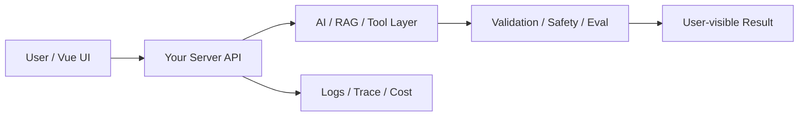

# W15 复盘：MCP Server：把你的工具标准化暴露给 AI

## 本周投入时间

-

## 本周完成的工程证据

- [ ] 最小 MCP Server 代码
- [ ] 工具调用截图或日志
- [ ] 非法参数拒绝记录

## 本周补齐的后端基础

- [ ] MCP Tool
- [ ] MCP Resource
- [ ] JSON Schema
- [ ] 最小权限暴露
- [ ] 本地调试

## 核心架构图

## 成功链路

- 输入：
- 服务端处理：
- AI / 数据层处理：
- 输出：
- 证据：

## 失败案例

- 现象：
- 原因：
- 修复或兜底：
- 下次如何提前发现：

## 可面试表达

### 30 秒版本

### 3 分钟版本

### 可能被追问

1.
2.
3.

## 下周继承

-
