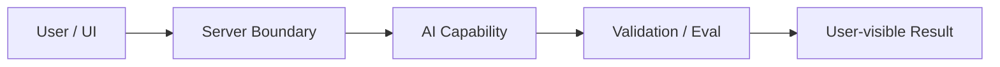

# W15 复盘：Agent 可靠性：幂等、重试、人工接管

## 本周投入时间

-

## 本周完成的工程证据

- [ ] 重复提交防护
- [ ] 失败恢复案例
- [ ] 审计日志样例

## 核心架构图

## 失败案例

- 现象：
- 原因：
- 修复或兜底：
- 下次如何提前发现：

## 可面试表达

### 30 秒版本

### 3 分钟版本

### 可能被追问

1.
2.
3.

## 下周继承

-
