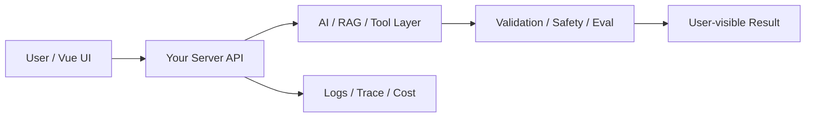

# W16 复盘：项目三：MCP + RAG + Tool 综合接口助手

## 本周投入时间

-

## 本周完成的工程证据

- [ ] 综合 Demo
- [ ] 多工具 Trace
- [ ] 项目架构图与失败样本

## 本周补齐的后端基础

- [ ] 多能力编排
- [ ] Trace 数据结构
- [ ] 错误传播
- [ ] 权限分层
- [ ] 综合项目验收

## 核心架构图

## 成功链路

- 输入：
- 服务端处理：
- AI / 数据层处理：
- 输出：
- 证据：

## 失败案例

- 现象：
- 原因：
- 修复或兜底：
- 下次如何提前发现：

## 可面试表达

### 30 秒版本

### 3 分钟版本

### 可能被追问

1.
2.
3.

## 下周继承

-
