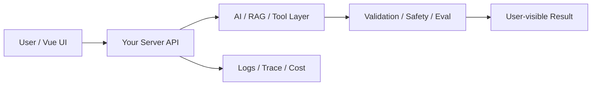

# W17 复盘：AI 产品边界：睡眠 / 情绪助手为什么难

## 本周投入时间

-

## 本周完成的工程证据

- [ ] 产品边界文档
- [ ] 高风险样本测试
- [ ] 安全提示截图

## 本周补齐的后端基础

- [ ] 用户数据最小化
- [ ] 敏感内容分类
- [ ] 安全策略路由
- [ ] 拒答 / 升级
- [ ] 隐私删除

## 核心架构图

## 成功链路

- 输入：
- 服务端处理：
- AI / 数据层处理：
- 输出：
- 证据：

## 失败案例

- 现象：
- 原因：
- 修复或兜底：
- 下次如何提前发现：

## 可面试表达

### 30 秒版本

### 3 分钟版本

### 可能被追问

1.
2.
3.

## 下周继承

-
