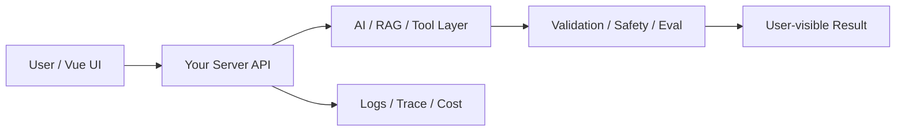

# W19 复盘：部署、监控与成本：作品集也要像真实项目

## 本周投入时间

-

## 本周完成的工程证据

- [ ] 部署说明
- [ ] 监控 / 日志截图
- [ ] 一次故障复盘文档

## 本周补齐的后端基础

- [ ] 部署环境变量
- [ ] CORS
- [ ] 限流
- [ ] 日志查询
- [ ] 成本估算
- [ ] 故障复盘

## 核心架构图

## 成功链路

- 输入：
- 服务端处理：
- AI / 数据层处理：
- 输出：
- 证据：

## 失败案例

- 现象：
- 原因：
- 修复或兜底：
- 下次如何提前发现：

## 可面试表达

### 30 秒版本

### 3 分钟版本

### 可能被追问

1.
2.
3.

## 下周继承

-
