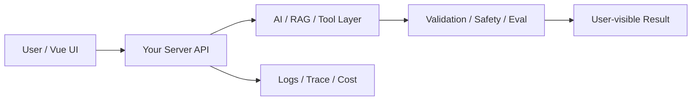

# W20 复盘：作品集、简历与 45 分钟项目答辩

## 本周投入时间

-

## 本周完成的工程证据

- [ ] 作品集首页
- [ ] 两版简历项目描述
- [ ] 45 分钟模拟答辩稿

## 本周补齐的后端基础

- [ ] 项目 README 标准
- [ ] 架构图表达
- [ ] 指标展示
- [ ] 面试追问准备
- [ ] 技术取舍复盘

## 核心架构图

## 成功链路

- 输入：
- 服务端处理：
- AI / 数据层处理：
- 输出：
- 证据：

## 失败案例

- 现象：
- 原因：
- 修复或兜底：
- 下次如何提前发现：

## 可面试表达

### 30 秒版本

### 3 分钟版本

### 可能被追问

1.
2.
3.

## 下周继承

-
