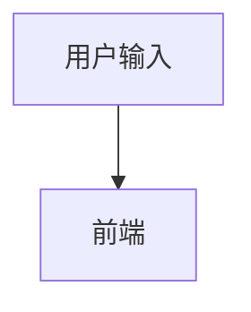

# 第1课：一个 AI 应用到底怎样工作

建议时间：45～60 分钟  
今天的目标：理解用户输入一句话后，系统内部发生了什么。

## 1. 先从你熟悉的前端请求开始

普通前端功能通常是：

```text
用户操作
  ↓
前端收集表单
  ↓
调用后端接口
  ↓
后端查询数据库或执行固定规则
  ↓
返回确定的数据
  ↓
前端展示
```

例如查询车辆详情：

```text
输入车辆 ID
  ↓
GET /vehicle/detail?id=123
  ↓
数据库查询 ID=123 的记录
  ↓
返回确定字段
```

如果数据库没有变化，相同 ID 通常得到相同结果。

## 2. AI 应用多了什么

以“职场沟通改写”为例：

```text
用户输入原话
  ↓
前端提交原话、沟通对象、目标和语气
  ↓
后端校验输入
  ↓
后端把数据组合成 Prompt
  ↓
调用大模型
  ↓
模型生成结果
  ↓
后端检查结果是否符合格式和安全要求
  ↓
前端展示结果
```

这里最关键的变化是：数据库通常“查出已有数据”，大模型通常“生成新的内容”。

生成意味着它有能力处理开放问题，但也意味着输出并非天然可靠。

## 3. Prompt 是什么

你可以暂时把 Prompt 理解为“发给模型的完整任务说明”。

用户只输入：

```text
这个需求根本做不了，你们先想清楚再说。
```

真正发给模型的内容可能是：

```text
你是一名职场沟通助手。

任务：
将用户原话改写为专业、清晰、坚定的工作沟通表达。

约束：
1. 不改变原意。
2. 不虚构事实。
3. 不增加用户没有承诺过的内容。
4. 不要过度道歉。

用户原话：
这个需求根本做不了，你们先想清楚再说。
```

用户输入只是 Prompt 的一部分。产品规则、上下文、示例和输出格式都可能属于 Prompt。

## 4. 为什么不能让浏览器直接调用模型

如果把模型服务的 API Key 写在前端代码里：

- 浏览器用户可以查看它；
- 别人可能盗用它产生费用；
- 难以统一校验输入；
- 难以记录模型错误和调用成本；
- 业务规则容易被绕过。

所以正式产品通常通过自己的服务端调用模型。

这和你熟悉的业务接口类似：前端负责交互，服务端负责密钥、权限、业务规则和外部服务调用。

## 5. 输出校验为什么重要

假设页面需要这样的数据：

```json
{
  "rewrittenText": "建议我们先进一步确认需求范围和实现条件，再评估可行方案。",
  "explanation": "保留了对可行性的质疑，同时降低了对抗性。"
}
```

模型可能返回：

- 一段普通文本，不是 JSON；
- JSON 缺少字段；
- 字段类型错误；
- 内容改变了用户原意；
- 空内容；
- 超时或服务报错。

因此“模型返回了内容”不等于“功能成功了”。

AI Product Engineer 需要把这些不稳定情况处理成用户可以理解的产品状态。

## 6. 动手练习

不要复制上面的流程。请根据自己的理解，画出“AI 职场沟通助手”的链路。

你可以使用普通文字：

```text
1. 用户……
2. 前端……
3. 服务端……
```

也可以使用 Mermaid：



至少包含：

- 用户输入；
- 前端；
- 服务端；
- Prompt；
- 大模型；
- 输出校验；
- 前端结果或错误提示。

把你的答案写入：

`reviews/week-01.md` 的“AI 应用链路图”。

## 7. 卡住时看这里

可以依次回答下面的问题，再把答案连起来：

1. 用户在页面填写了什么？
2. 前端把哪些内容提交给服务端？
3. 服务端调用模型前要做什么？
4. 模型返回后为什么不能立刻展示？
5. 模型失败时页面应该告诉用户什么？

## 8. 今日验收

先不要查资料，用自己的话回答：

1. 用户输入和 Prompt 是同一个东西吗？为什么？
2. 数据库查询和大模型生成的主要区别是什么？
3. 为什么正式应用通常由服务端调用大模型？
4. 模型已经返回文字，为什么还可能算失败？

完成后停止，不要急着学习第2课。先把作业交给老师检查。
