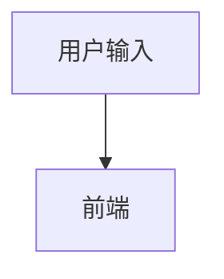

# 第1课：一个 AI 应用到底怎样工作

建议时间：首次搭建约 90～120 分钟，可以拆成两天
今天的目标：亲手运行一个最小 AI 应用，并理解用户输入一句话后，系统内部发生了什么。

## 0. 这节课需要你自己搭建吗？

需要动手，但老师已经准备好最小实验骨架，你不需要面对空文件从零猜。

你的任务分为三层：

1. 先按照步骤运行；
2. 沿着一次请求阅读代码；
3. 亲手修改 Prompt 并观察结果。

统一 Demo 项目：

`demo-app`

详细操作说明：

[`Demo 项目说明`](../../demo-app/README.md)

## 0.1 第一步：打开终端

在 VS Code 顶部菜单选择：

```text
终端 → 新建终端
```

检查终端当前目录。如果不是下面的路径：

```text
G:\ai-product-engineer-year-plan
```

执行：

```powershell
cd G:\ai-product-engineer-year-plan
```

## 0.2 第二步：启动项目

执行：

```powershell
npm run demo
```

成功后终端会显示：

```text
公共 API 服务已启动：http://127.0.0.1:3001
VITE ready
```

不要关闭这个终端。使用 PC 浏览器打开：

```text
http://localhost:5180
```

如果端口被占用、页面打不开或命令报错，停止继续操作，把完整错误发给老师。

打开首页后，点击：

```text
LAB 01 → 进入实验
```

## 0.3 第三步：发出第一条请求

在页面输入：

```text
这个需求根本做不了，你们先想清楚再说。
```

点击“帮我改写”。

你应该看到：

- 按钮进入加载状态；
- 页面显示改写结果；
- 终端依次打印用户输入、Prompt、模拟模型结果。

现在先不要改代码。对照终端输出，找出用户输入在 Prompt 中出现的位置。

## 0.4 第四步：观察浏览器请求（前端基础，可跳过）

按 `F12` 打开开发者工具：

1. 选择 `Network`；
2. 再点击一次“帮我改写”；
3. 找到 `rewrite` 请求；
4. 查看 `Payload`；
5. 查看 `Response`。

如果你没有前后端联调经验，可以记录：

- 请求方法；
- 请求地址；
- 请求的三个字段；
- 响应的两个字段；
- HTTP 状态码。

你已有前端接口联调经验，本节不作为验收项，只需确认请求链路能正常运行。

## 0.5 第五步：理解 Prompt 的动态组成

打开：

`demo-app/server/labs/01-ai-app-chain/build-prompt.js`

阅读 Prompt 构造代码，确认以下内容分别来自哪里：

```text
固定任务
固定约束
用户原话
沟通对象
期望语气
```

你不需要为了证明会修改字符串而机械增加一条规则。请思考：

- 哪些内容应该由产品固定；
- 哪些内容应该由用户输入；
- 哪些内容应该由服务端业务规则决定；
- 任务变化时是否应该切换 Prompt 模板。

## 0.6 第六步：理解模型输出为什么需要校验

分别输入：

```text
[返回空结果]
```

和：

```text
[返回错误格式]
```

你有前端异常处理经验，不需要重复证明会显示错误提示。重点观察：

- HTTP 请求成功为什么仍可能是业务失败；
- 模型返回对象为什么不能直接信任；
- 格式校验和内容质量校验有什么区别；
- 接入真实模型后还会出现哪些当前模拟代码没有覆盖的问题。

至此你已经亲手跑通：

```text
页面输入 → API 请求 → 服务端校验 → 构造 Prompt
→ 模拟模型 → 输出校验 → 页面展示或报错
```

## 1. 先从你熟悉的前端请求开始

普通前端功能通常是：

```text
用户操作
  ↓
前端收集表单
  ↓
调用后端接口
  ↓
后端查询数据库或执行固定规则
  ↓
返回确定的数据
  ↓
前端展示
```

例如查询车辆详情：

```text
输入车辆 ID
  ↓
GET /vehicle/detail?id=123
  ↓
数据库查询 ID=123 的记录
  ↓
返回确定字段
```

如果数据库没有变化，相同 ID 通常得到相同结果。

## 2. AI 应用多了什么

以“职场沟通改写”为例：

```text
用户输入原话
  ↓
前端提交原话、沟通对象、目标和语气
  ↓
后端校验输入
  ↓
后端把数据组合成 Prompt
  ↓
调用大模型
  ↓
模型生成结果
  ↓
后端检查结果是否符合格式和安全要求
  ↓
前端展示结果
```

这里最关键的变化是：数据库通常“查出已有数据”，大模型通常“生成新的内容”。

生成意味着它有能力处理开放问题，但也意味着输出并非天然可靠。

## 3. Prompt 是什么

你可以暂时把 Prompt 理解为“发给模型的完整任务说明”。

用户只输入：

```text
这个需求根本做不了，你们先想清楚再说。
```

真正发给模型的内容可能是：

```text
你是一名职场沟通助手。

任务：
将用户原话改写为专业、清晰、坚定的工作沟通表达。

约束：
1. 不改变原意。
2. 不虚构事实。
3. 不增加用户没有承诺过的内容。
4. 不要过度道歉。

用户原话：
这个需求根本做不了，你们先想清楚再说。
```

用户输入只是 Prompt 的一部分。产品规则、上下文、示例和输出格式都可能属于 Prompt。

## 4. 为什么不能让浏览器直接调用模型

如果把模型服务的 API Key 写在前端代码里：

- 浏览器用户可以查看它；
- 别人可能盗用它产生费用；
- 难以统一校验输入；
- 难以记录模型错误和调用成本；
- 业务规则容易被绕过。

所以正式产品通常通过自己的服务端调用模型。

这和你熟悉的业务接口类似：前端负责交互，服务端负责密钥、权限、业务规则和外部服务调用。

## 5. 输出校验为什么重要

假设页面需要这样的数据：

```json
{
  "rewrittenText": "建议我们先进一步确认需求范围和实现条件，再评估可行方案。",
  "explanation": "保留了对可行性的质疑，同时降低了对抗性。"
}
```

模型可能返回：

- 一段普通文本，不是 JSON；
- JSON 缺少字段；
- 字段类型错误；
- 内容改变了用户原意；
- 空内容；
- 超时或服务报错。

因此“模型返回了内容”不等于“功能成功了”。

AI Product Engineer 需要把这些不稳定情况处理成用户可以理解的产品状态。

## 6. 动手练习

不要复制上面的流程。请根据自己的理解，画出“AI 职场沟通助手”的链路。

你可以使用普通文字：

```text
1. 用户……
2. 前端……
3. 服务端……
```

也可以使用 Mermaid：



至少包含：

- 用户输入；
- 前端；
- 服务端；
- Prompt；
- 大模型；
- 输出校验；
- 前端结果或错误提示。

把你的答案写入：

`reviews/week-01.md` 的“AI 应用链路图”。

## 7. 卡住时看这里

可以依次回答下面的问题，再把答案连起来：

> 批注颜色：
> <span style="color:#16803c;">绿色＝理解正确</span>；
> <span style="color:#c56a00;">橙色＝方向正确，但需要补充</span>；
> <span style="color:#c62828;">红色＝需要修正</span>。

### 1. 用户在页面填写了什么？

你的回答：用户在页面输入想要提问的内容以及选中的沟通对象、目标和语气。

<span style="color:#c62828;"><strong>老师批注（需要修正）：</strong>
你已经知道要区分用户正文和页面选项，但回答要以当前 Demo 的真实字段为准。
目前页面只有“用户原话、沟通对象、期望语气”三个字段，并没有“目标”字段。
另外这里不是泛泛的“提问内容”，而是需要改写的原始工作消息。</span>

建议答案：

```text
用户填写需要改写的原话，并选择沟通对象和期望语气。
```

### 2. 前端把哪些内容提交给服务端？

你的回答：把用户在页面输入想要提问的内容以及选中的沟通对象、目标和语气推送给服务器。

<span style="color:#c62828;"><strong>老师批注（需要修正）：</strong>
链路理解正确，但仍然多写了当前接口不存在的“目标”字段。接口契约必须以真实
Payload 为准，不能根据产品设想补字段。“推送”也可以改为更准确的“通过 POST
请求提交”。</span>

建议答案：

```text
前端通过 POST 请求向服务端提交 originalText、audience 和 tone 三个字段。
```

### 3. 服务端调用模型前要做什么？

你的回答：服务端调用模型前要校验输入，把数据和 Prompt 组合成内容传给大模型。

<span style="color:#16803c;"><strong>老师批注（理解正确）：</strong>
回答抓住了本课最重要的两个步骤：输入校验和 Prompt 构造。真实项目中还可能加入
身份验证、权限检查、限流和敏感内容检查，但当前阶段回答已经合格。</span>

### 4. 模型返回后为什么不能立刻展示？

你的回答：模型返回后需要校验结果是否符合格式和安全要求。

<span style="color:#16803c;"><strong>老师批注（理解正确）：</strong>
正确。还可以继续想到：即使格式正确，也要检查必填字段是否为空、字段类型是否正确，
以及内容有没有改变用户原意。</span>

### 5. 模型失败时页面应该告诉用户什么？

你的回答：模型失败时页面应该告诉用户请求失败，请稍后再试。

<span style="color:#c56a00;"><strong>老师批注（需要补充）：</strong>
这是合格的基础提示，但真实产品最好给用户可执行的下一步，同时保留用户输入。例如：
“暂时无法生成，请稍后重试”，并提供重试按钮。不要把 API Key、异常堆栈或模型服务商
的原始报错直接显示给用户。</span>

## 8. 今日验收

先不要查资料，用自己的话回答：

### 1. 用户输入和 Prompt 是同一个东西吗？为什么？

你的回答：不是，用户输入是 Prompt 的一部分。

<span style="color:#16803c;"><strong>老师批注（理解正确）：</strong>
准确而且简洁。完整 Prompt 还可能包含固定任务、产品约束、动态上下文、示例和输出格式。
</span>

### 2. 数据库查询和大模型生成的主要区别是什么？

你的回答：数据库内容是固定的，大模型生成的内容是动态的。

<span style="color:#c62828;"><strong>老师批注（需要修正）：</strong>
“数据库内容是固定的”不准确，数据库中的数据也会不断新增和修改。关键区别是：
数据库查询按照明确条件检索已经存储的数据；大模型根据上下文生成新的内容。同一次
数据库查询在数据和条件不变时通常结果确定，而模型生成可能存在变化，也可能生成错误事实。
</span>

建议答案：

```text
数据库查询是在已有数据中按确定条件检索；大模型是在上下文基础上生成内容。
前者通常更确定，后者能够处理开放任务，但结果可能变化且不天然可靠。
```

### 3. 为什么正式应用通常由服务端调用大模型？

你的回答：安全性、成本。

<span style="color:#c56a00;"><strong>老师批注（方向正确，但需要展开）：</strong>
你指出了两个正确方向，但还需要解释具体含义。服务端可以保护 API Key、验证用户权限、
限制调用频率和费用、统一构造 Prompt、记录日志，并校验模型输出。只写“成本”还不能说明
服务端怎样控制成本。</span>

建议答案：

```text
服务端调用可以避免 API Key 暴露，并统一处理权限、限流、Prompt、日志、
费用统计和模型输出校验。
```

### 4. 模型已经返回文字，为什么还可能算失败？

你的回答：模型返回的内容可能不符合格式和安全要求。

<span style="color:#16803c;"><strong>老师批注（理解正确）：</strong>
正确。模型“有返回”只是网络调用成功，不代表业务成功。空字段、错误类型、偏离任务、
虚构事实或改变用户原意，都应视为业务失败或需要再次处理。</span>

## 老师阶段评价

<span style="color:#16803c;"><strong>已掌握：</strong>
你已经理解传统前端链路、Prompt 与用户输入的关系，以及模型输出必须校验。</span>

<span style="color:#c56a00;"><strong>需要加强：</strong>
回答接口问题时必须对照真实 Payload，不添加当前不存在的字段；解释概念时要说出机制，
不能只停留在“安全性、成本”这样的关键词。</span>

<span style="color:#c56a00;"><strong>本课验收调整：</strong>
考虑到你已有前端开发和接口联调经验，Network 请求记录、基础状态码观察、机械修改
Prompt 字符串和页面错误展示不再作为验收项。你只需补充一份“AI 特有部分说明”：
Prompt 如何组成、真实模型替换点在哪里、模型返回后为什么仍需校验。</span>

完成后停止，不要急着学习第2课。先把作业交给老师检查。
