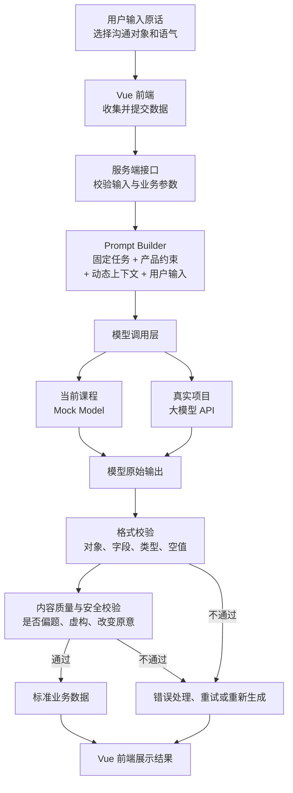

# 第 1 周复盘

日期：2026-06-22  
实际投入时间：  
本周状态：进行中

## AI 应用链路图（可选）



### 这张图重点看什么

传统前端部分：

```text
页面 → 服务端接口 → 页面展示
```

AI 应用新增的核心部分：

```text
Prompt 构造
→ 模型调用
→ 模型原始输出
→ 格式校验
→ 内容质量与安全校验
```

当前 Demo 的 `Mock Model` 以后会替换为真实大模型 API，但前端表单、Prompt Builder、输出校验和页面展示等其他层仍然可以保留。

## 实验 01 请求观察（跳过）

已有前端联调经验，不作为验收项。

## AI 特有部分说明（第1课必做）

### 1. 当前 Prompt 由哪些固定内容和动态内容组成？

通用规律：Prompt 通常可以拆成“固定规则”和“动态输入”。

固定规则指：只要任务类型不变，就相对稳定的内容，例如任务目标、输出格式、质量要求、禁止事项、边界条件。

动态输入指：每次请求都会变化的内容，例如用户输入、用户选择、业务上下文、检索结果、当前页面状态等。

我的理解是：用户输入不是完整 Prompt，而是 Prompt 的一部分。真实应用里，服务端通常会把固定规则和动态输入组合成最终 Prompt，再交给模型处理。

需要注意：不同任务的固定规则不一样。不要记某个案例里的具体规则，要记“固定规则 + 动态输入”这个拆分方法。

### 2. 接入真实模型时，需要替换当前哪一层？哪些层可以保留？

需要替换的是模型调用层：当前 Demo 中的 Mock Model，以后会替换成真实大模型 API，例如 DeepSeek。

可以保留的部分包括：

- 前端表单；
- 服务端接口；
- 输入校验；
- Prompt Builder；
- 输出格式校验；
- 内容质量与安全校验；
- 前端结果展示和错误处理。

我的理解是：接入真实模型不是把整个前端推翻重写，而是把“生成内容的那一层”从 Mock 换成真实 API。

### 3. 模型返回后，格式校验与内容质量校验分别检查什么？

格式校验主要检查：

- 返回结果是不是合法结构；
- 字段是否存在；
- 字段类型是否正确；
- 必填内容是否为空；
- JSON 或对象结构是否符合前端和服务端约定。

内容质量校验主要检查：

- 是否保持用户原意；
- 是否虚构了用户没有提供的事实；
- 语气是否符合目标对象；
- 是否可以直接用于真实业务场景；
- 是否存在安全风险或误导性表达。

我现在要特别记住：模型“返回了内容”不等于业务成功。格式对了，也不代表内容一定合格。

### 4. 同一任务何时复用 Prompt，何时应该切换 Prompt？

同一类任务可以复用同一个 Prompt 模板，例如都是“职场沟通改写”，只是用户原话、沟通对象、语气不同，这时应该复用模板，只替换动态变量。

不同任务应该切换 Prompt 模板，例如：

- 职场沟通改写；
- 情绪陪伴回复；
- 睡眠建议；
- 信息提取；
- 风险分类。

我的理解是：任务目标不同，评价标准也不同，所以不能把所有用户输入都塞进同一个 Prompt 里硬做。

## 两个失败实验（可选）

用于没有前端异常处理经验时观察链路；你可以跳过。

## 第2课：模型不确定性

### 低 Temperature 观察

- 使用数值：课程建议观察 0.2。
- 两轮结果有什么相同点：结果通常会更保守、更接近，表达重点更稳定。
- 两轮结果有什么不同点：即使 temperature 较低，也可能存在措辞差异，不一定一字不差。
- 我的结论：低 temperature 可以提高稳定性，但不等于数据库查询，也不能保证完全相同。
- 当前状态：待接入真实 DeepSeek 后，再补充真实两轮输出对比。

### 高 Temperature 观察

- 使用数值：课程建议观察 0.9。
- 输出发生了什么变化：结果会更发散，表达方式可能更丰富，也更容易添加用户没有明确提供的信息。
- 找到的无依据信息：如果模型生成了时间、排期、承诺、原因等用户没有提供的内容，就属于需要警惕的信息。
- 我的结论：高 temperature 更适合创意类任务，但不一定更适合业务场景。业务场景更关注可控、可靠和可验证。
- 当前状态：待接入真实 DeepSeek 后，再补充真实高 temperature 输出中的无依据信息。

### 选择一个结果进行四维评价

- 选择的结果：以“职场沟通改写”结果为例。
- 原意保持：需要仍然表达“当前需求存在实现困难”或“需要先明确条件”，不能把原意改成已经承诺完成。
- 事实可靠：不能新增时间、排期、原因、负责人或承诺，除非用户原文已经提供。
- 语气匹配：应该专业、坚定、可沟通，不能攻击对方，也不能过度示弱。
- 可直接使用：如果内容事实可靠、语气合适、没有虚构信息，就可以作为候选结果；如果只是听起来好听但虚构事实，就不能直接使用。

### 第2课验收问题

#### 1. 为什么相同 Prompt 可能得到不同结果？

因为大模型不是数据库查询，而是根据 Prompt、上下文、模型参数和采样策略进行概率生成。

数据库是在已有数据中按条件查询，条件和数据不变时通常结果确定；大模型是在生成内容，即使 Prompt 相同，也可能选择不同的表达方式。

#### 2. 输出不同是否一定代表模型失败？为什么？

不一定。

输出不同只是说明模型生成结果存在变化。是否失败要看它是否满足产品标准，例如是否保持原意、事实是否可靠、语气是否匹配、是否可以直接使用。

如果表达不同但核心意思一致，并且没有虚构事实，就不算失败。

#### 3. Temperature 调低为什么不能消除幻觉？

因为 temperature 主要控制输出的发散程度，不控制事实是否正确。

把 temperature 调低，可以让输出更保守、更稳定，但如果 Prompt 缺少事实约束，或者模型本身没有可靠依据，它仍然可能生成看起来合理但没有依据的内容。

所以还需要后端校验、结构化输出、事实边界、失败重试和必要的人工确认。

#### 4. “格式正确”和“内容合格”有什么区别？

格式正确是指 AI 返回的数据结构、字段、JSON 格式符合要求。

内容合格是指 AI 返回的内容在事实、原意、语气和业务目标上都满足要求。

比如返回了合法 JSON，只能说明格式正确；但如果 JSON 里的建议虚构了时间、承诺或原因，内容仍然不合格。

#### 5. 为什么不能只测试一个输入、看一次结果就认为 Prompt 有效？

因为 AI 输出不是确定函数，同一个 Prompt 也可能生成不同结果。

只测试一个输入、一次结果，只能说明这个案例碰巧可用，不能说明 Prompt 在其他输入、边界情况、失败场景和高风险场景下都可靠。

真实项目里需要多组测试数据，观察结果是否稳定满足评测标准。

## 三个真实问题

1. 同一个 Prompt 为什么每次生成结果不完全一样？
2. 如果 Prompt、上下文、模型参数和采样策略都一样，结果是否一定一样？
3. 不同任务应该由服务端规则判断 Prompt 模板，还是交给大模型判断？

## 项目一候选场景

- AI 职场沟通助手：用户输入原始工作消息，选择沟通对象和语气，由 AI 改写成更专业、清晰、可发送的表达。

## 验收问题回答

### 1. 大模型和普通数据库查询有什么区别？

数据库查询是在已有数据中按确定条件检索；大模型是在上下文基础上生成内容。

前者通常更确定，后者能够处理开放任务，但结果可能变化，也不天然可靠。

### 2. 为什么同一个问题可能得到不同答案？

因为大模型生成结果受 Prompt、上下文、模型参数和采样策略影响。它不是返回一条固定记录，而是逐步生成 token，所以同一个问题可能得到表达不同但意思接近的答案。

### 3. 为什么不能只看一条满意回答就说 Prompt 有效？

因为一条满意回答只能说明这个案例碰巧可用，不能证明 Prompt 在不同输入、边界情况、失败场景和高风险场景下都可靠。

Prompt 是否有效，需要通过多组测试数据和明确评测标准判断。

### 4. 一个 AI 功能从输入到展示至少需要哪些环节？

至少包括：

- 用户输入；
- 前端提交；
- 服务端校验；
- Prompt 构造；
- 模型调用；
- 模型原始输出；
- 格式校验；
- 内容质量与安全校验；
- 前端展示结果或错误提示。

### 5. AI Product Engineer 和只会调用 API 的前端开发有什么区别？

只会调用 API 的前端开发更关注“把请求发出去、把结果展示出来”。

AI Product Engineer 还要理解任务设计、Prompt 模板、模型不确定性、输出校验、评测标准、安全边界和产品体验。重点不是“能不能调通模型”，而是“能不能把模型能力变成稳定、可用、可验证的产品功能”。

## 一个失败案例

- 现象：AI 返回了格式正确的结果，但内容里出现了用户没有提供的时间、排期或承诺。
- 原因：模型为了让表达更完整，补充了看似合理但没有依据的信息；temperature 调低只能减少发散，不能保证事实正确。
- 如何处理：Prompt 中明确禁止编造事实；服务端校验高风险字段；必要时让用户确认；对失败结果进行重试或提示用户补充信息。

## 我最卡的地方

- 如何判断“输出不同但仍然合格”和“输出已经偏离任务”之间的边界。
- 如何把“感觉这个回答不错”变成明确的评测标准。

## 我想问老师

- 真实项目中，哪些任务适合低 temperature，哪些任务可以用高 temperature？
- Prompt 模板切换应该优先由服务端规则判断，还是让大模型先判断用户意图？
