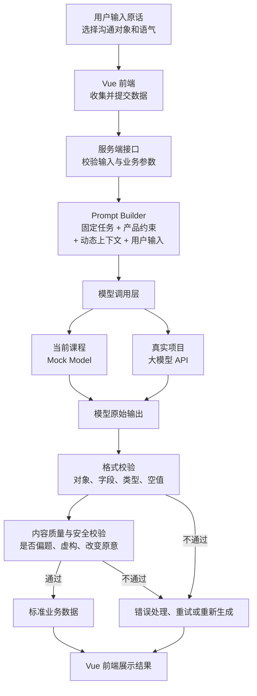

# 第 1 周复盘

日期：2026-06-22  
实际投入时间：  
本周状态：进行中

## AI 应用链路图（可选）



### 这张图重点看什么

传统前端部分：

```text
页面 → 服务端接口 → 页面展示
```

AI 应用新增的核心部分：

```text
Prompt 构造
→ 模型调用
→ 模型原始输出
→ 格式校验
→ 内容质量与安全校验
```

当前 Demo 的 `Mock Model` 以后会替换为真实大模型 API，但前端表单、
Prompt Builder、输出校验和页面展示等其他层仍然可以保留。

## 实验 01 请求观察（跳过）

已有前端联调经验，不作为验收项。

## AI 特有部分说明（第1课必做）

### 1. 当前 Prompt 由哪些固定内容和动态内容组成？


### 2. 接入真实模型时，需要替换当前哪一层？哪些层可以保留？


### 3. 模型返回后，格式校验与内容质量校验分别检查什么？


### 4. 同一任务何时复用 Prompt，何时应该切换 Prompt？


## 两个失败实验（可选）

用于没有前端异常处理经验时观察链路；你可以跳过。

## 第2课：模型不确定性

### 低 Temperature 观察

- 使用数值：
- 两轮结果有什么相同点：
- 两轮结果有什么不同点：
- 我的结论：

### 高 Temperature 观察

- 使用数值：
- 输出发生了什么变化：
- 找到的无依据信息：
- 我的结论：

### 选择一个结果进行四维评价

- 选择的结果：
- 原意保持：
- 事实可靠：
- 语气匹配：
- 可直接使用：

### 第2课验收问题

#### 1. 为什么相同 Prompt 可能得到不同结果？


#### 2. 输出不同是否一定代表模型失败？为什么？


#### 3. Temperature 调低为什么不能消除幻觉？


#### 4. “格式正确”和“内容合格”有什么区别？


#### 5. 为什么不能只测试一个输入、看一次结果就认为 Prompt 有效？

## 三个真实问题

1. 
2. 
3. 

## 项目一候选场景

- 

## 验收问题回答

### 1. 大模型和普通数据库查询有什么区别？


### 2. 为什么同一个问题可能得到不同答案？


### 3. 为什么不能只看一条满意回答就说 Prompt 有效？


### 4. 一个 AI 功能从输入到展示至少需要哪些环节？


### 5. AI Product Engineer 和只会调用 API 的前端开发有什么区别？


## 一个失败案例

- 现象：
- 原因：
- 如何处理：

## 我最卡的地方

- 

## 我想问老师

- 
